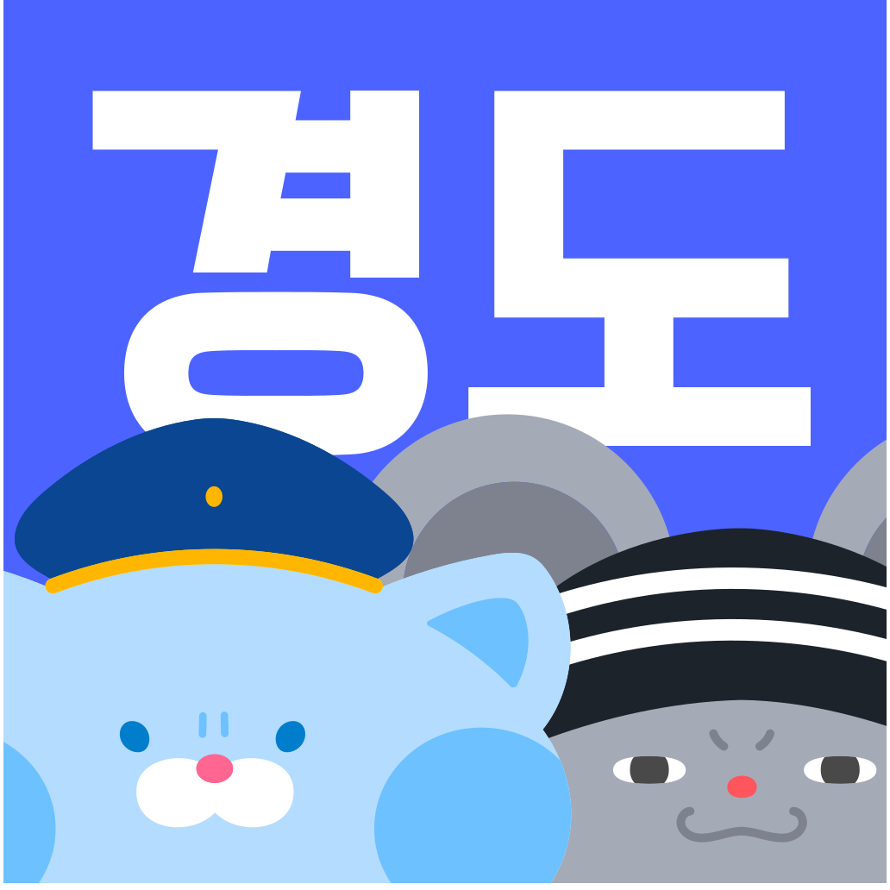
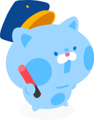
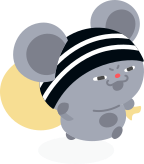
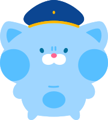
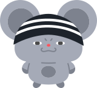

<div align="center">



# 경찰과 도둑 - 공식 웹사이트

**추억의 게임에서 가치를 찾습니다**

 

GPS 기반 실외 술래잡기 게임 **경찰과 도둑**의 공식 홈페이지입니다.
게임 소개, 팀 블로그, 앱으로 이어지는 딥링크, 오프라인 행사 운영 도구까지 -
팀 **동심지키미**의 웹 전초기지예요.

[홈페이지](https://copsnro66ers.site) · [Google Play](https://play.google.com/store/apps/details?id=com.elipair.copsandrobbers) · [App Store](https://apps.apple.com/kr/app/경찰과도둑/id6756843948) · [Instagram](https://www.instagram.com/cops._.robbers)

</div>

---

##  어떤 사이트인가요

| 페이지 | 설명 |
| --- | --- |
| `/` | 홈 - 게임의 첫인상, 다운로드 유도 |
| `/game` | 게임 소개 - 규칙, 핵심 기능, FAQ |
| `/blog` | **이야기** - 노션에 쓰면 그대로 발행되는 팀 블로그 |
| `/team` | 팀 소개 - 동심지키미 멤버들과 도움 주신 분들 |

###  앱으로 이어지는 링크

앱과 현장을 잇는 다리 역할도 해요:

| 페이지 | 설명 |
| --- | --- |
| `/join/[code]` | **게임 방 초대 딥링크** - 링크 하나로 친구를 방에 초대 |
| `/download` | **스마트 다운로드** - 기기를 인식해 알맞은 스토어로 리다이렉트 (부스 QR용) |

###  오프라인 행사 모드

행사 당일에만 열리는 페이지들이에요 (날짜 게이트, 평소엔 티저/감사 화면):

| 페이지 | 설명 |
| --- | --- |
| `/event` | 행사 스토리 - 세계관 소개 (예: 서울 게임 타운 "황금 치즈 도난 사건") |
| `/photobooth` | 네컷 포토부스 키오스크 - 촬영 → 4컷 선택 → 프레임 합성 → QR 발급 |
| `/p` | 발급된 네컷 사진 받기 |
| `/play` | 부스 미니게임 "도둑을 잡아라" - 공유 리더보드 |

## 🛠️ 어떻게 만들었나요

- **Next.js 16 (App Router)** + React 19 + Tailwind CSS v4
- **블로그**: Notion API를 CMS로 사용 - 팀원이 노션에 글을 쓰고 체크박스만 켜면 ISR로 발행돼요. 블록 렌더러, 만료되는 노션 이미지 프록시, 글별 동적 OG 카드, Article JSON-LD까지 직접 구현했어요.
- **포토부스**: 웹캠 촬영부터 Canvas 프레임 합성, Vercel Blob 업로드, QR 발급까지 전부 브라우저에서.
- **리더보드**: Upstash Redis 정렬 집합으로 닉네임별 최고 점수를 관리해요.
- **테마**: 경찰(라이트·파랑)과 도둑(다크·초록), 두 진영을 대등하게 담은 듀얼 테마.

## 🚀 시작하기

```bash
pnpm install
pnpm dev
```

환경변수는 `.env.local`에 (없어도 사이트는 뜨고, 해당 기능만 비활성화돼요):

| 변수 | 용도 |
| --- | --- |
| `NOTION_TOKEN` | 블로그 - 노션 통합 시크릿 |
| `NOTION_BLOG_DATABASE_ID` | 블로그 - 글 데이터베이스 ID |
| `BLOB_READ_WRITE_TOKEN` | 포토부스 - Vercel Blob 업로드 |
| `UPSTASH_REDIS_REST_URL` / `UPSTASH_REDIS_REST_TOKEN` | 미니게임 리더보드 |

블로그 글 쓰는 법은 [글쓰기 가이드](./docs/blog-writing-guide.md)를 봐주세요.

## 📚 문서 지도

상황에 맞는 문서를 찾아가세요. 코드나 규칙이 바뀌면 해당 문서도 같이 고칩니다.

| 무엇을 하려면 | 여기를 보세요 |
| --- | --- |
| 블로그에 글을 쓰고 싶어요 (팀원 누구나) | [docs/blog-writing-guide.md](./docs/blog-writing-guide.md) |
| 코드 구조를 파악하고 싶어요 | [docs/architecture.md](./docs/architecture.md) |
| 커밋·코드 스타일·테마 규칙이 궁금해요 | [docs/conventions.md](./docs/conventions.md) |
| 사이트 문구(카피)를 쓰거나 고쳐요 | [docs/copy-guide.md](./docs/copy-guide.md) |
| 블로그 시스템(노션 CMS)을 개발해요 | [docs/blog-system.md](./docs/blog-system.md) |
| 빌드·배포가 이상해요 | [docs/gotchas.md](./docs/gotchas.md) |
| UI 컴포넌트를 눈으로 보고 싶어요 | 사이트의 [/design](https://copsnro66ers.site/design) 페이지 |
| AI 도구(Claude 등)로 작업해요 | [AGENTS.md](./AGENTS.md)가 자동 로드돼요 |

## 👮🐭 팀

**동심지키미** - 경찰과 도둑을 만드는 7인 팀입니다. [팀 소개](https://copsnro66ers.site/team)에서 만나요.

<div align="center">

 &nbsp; 

*오늘도 열심히 쫓고, 도망치는 중*

</div>
